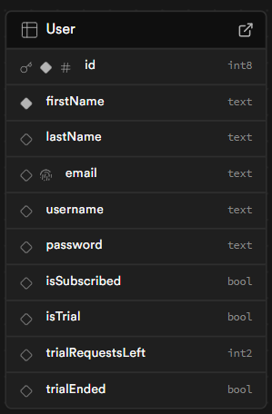

# Charles - Stock Charting Assistant

A website AI Chatbot that can produce stock charts with indicators based on user input – saving time for investors looking for a quick technical snapshot of a stock.

## Setup Instructions

1. **Clone the repository:**

   ```sh
   git clone <repository-url>
   cd <repository-directory>
   ```

2. **Create a virtual environment:**

   ```sh
   python -m venv charles
   ```

3. **Activate the virtual environment:**

   - On Windows:
     ```sh
     charles\Scripts\activate
     ```
   - On macOS/Linux:
     ```sh
     source charles/bin/activate
     ```

4. **Install dependencies:**

   ```sh
   pip install -r requirements.txt
   ```

5. **Set up environment variables:**

   - Download the [.env](http://_vscodecontentref_/11) file from your Teams Agile Group Project and place it in the root directory of the project.

6. **Run the application:**
   ```sh
   streamlit run main.py
   ```

## Usage

To use Charles, you need to provide a company name or ticker in the prompt. By default, if you do not provide an indicator, Charles will provide the closing price chart.

### Available Indicators

You can specify one or more of the following indicators to view in a chart:

- SMA (Simple Moving Average)
- EMA (Exponential Moving Average)
- RSI (Relative Strength Index)
- MACD (Moving Average Convergence Divergence)
- ADX (Average Directional Index)
- Bollinger Bands
- OBV (On Balance Volume)
- DMI (Directional Movement Index)
- Parabolic SAR
- VROC (Volume Rate of Change)

### Available Timespans

You can specify one of the following timespans to view in a chart:

- Hour
- Day
- Week
- Month
- Quarter
- Year

### News and Financials

You can specify to see the stock's news and financials as well:

- "Show news"
- "Add news"
- "Stop news"
- "Remove news"
- "Show financials"
- "Add financials"
- "Stop financials"
- "Remove financials"

### Example Prompts

- "I want to see Microsoft with the following indicators SMA, VROC, OBV, and DMI"
- "Remove DMI"
- "Add MACD"
- "Use Timespan of a Month"
- "Remove SMA"
- "Change Timespan to Week"
- "Remove MACD and OBV"

## File Descriptions

- **main.py**: Entry point for the Streamlit application.
- **indicators/calculations.py**: Contains functions to calculate various technical indicators.
- **indicators/plot.py**: Contains functions to plot stock data with indicators.
- **polygon/data_fetcher.py**: Contains functions to fetch stock data from Polygon.io.
- **polygon/display_financials.py**: Contains functions to display financial data.
- **polygon/display_news.py**: Contains functions to display news data.
- **pages/home.py**: Home page for the application.
- **pages/login.py**: Login page for the application.
- **pages/register.py**: Registration page for new users.
- **pages/stocks.py**: Main page for viewing stock data and charts.
- **pages/subscribeUser.py**: Page for subscribing to the service.
- **pages/unsubscribeUser.py**: Page for unsubscribing from the service.

## SUPABASE DB Schema



## Acknowledgements

- [Streamlit](https://streamlit.io/)
- [Supabase](https://supabase.io/)
- [Polygon.io](https://polygon.io/)
- [OpenAI](https://openai.com/)
